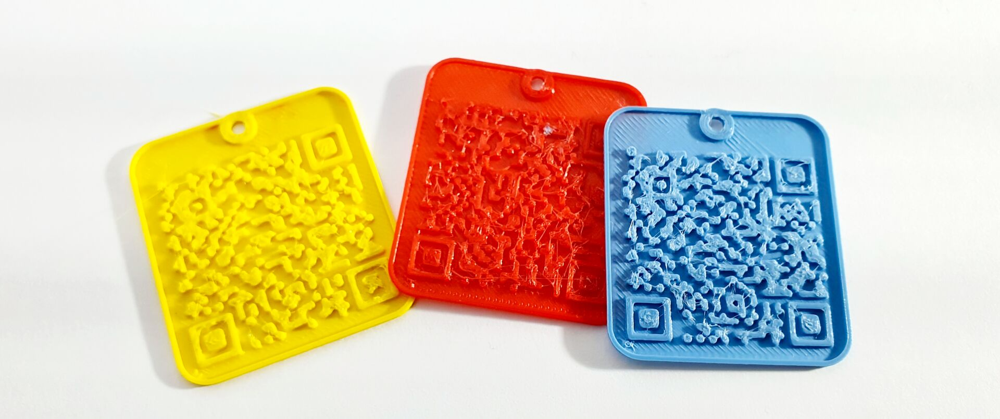

# Open-Filament



**Open-Filament** is an collection of 3D-Printing filament producers, materials and product lines.

It's main purpose is to give you an easy solution to label your test print's and filament spools with a **QR-Code**.

You can simply open [https://open-filament.github.io/](https://open-filament.github.io/):

- browser producers
- browse materials
- browse filaments
- download QR-Code badge as STL or OpenSCAD file
- print

It's based on [Hugo](https://gohugo.io/) and [Bulma](https://bulma.io/).

## Contribute

When you want to contribute, visit [GitHub](https://github.com/open-filament/open-filament.github.io) first.

### Add new producers

Each producer will be saved under [data/](data/) folder as YAML file. Feel free to create a pull request on GitHub to extend the number of producers.

A producer is defined by the following YAML file schema, see ``example.yml``:

```yaml
producer:
  name: example producer
  materials:
    PLA+:
      filaments:
        PLAPlus Filament:
          color: "#FF0000"
    PETG:
      filaments:
        3D Filament - PETG:
```

Each filament will start with it's name and can optionally have child data. At the moment the color data is supported and will be rendered to the HTML pages.

### Run locally

1. Install [Hugo](https://gohugo.io/) and make it available via PATH
2. Install Python > 3.10
3. Git clone this repo
4. Run ``pip install -r requirements.txt``
5. Run ``python main.py``
6. Markdown files are generated under [content/producers/](content/producers/)

> producers content files aren't stored in the master branch. Because they are generated by Python script in step 5.

> the first run might take a little longer, when generating all the STL files. The generation process will be skipped by the next run.

7. Run ``hugo serve``

### Build

> Only for contributers, who have rights to push to **master** or **gh-pages** branch.

1. Run ``hugo``
2. Copy contents of ``public/`` folder to a repo on **gh-pages** branch.
