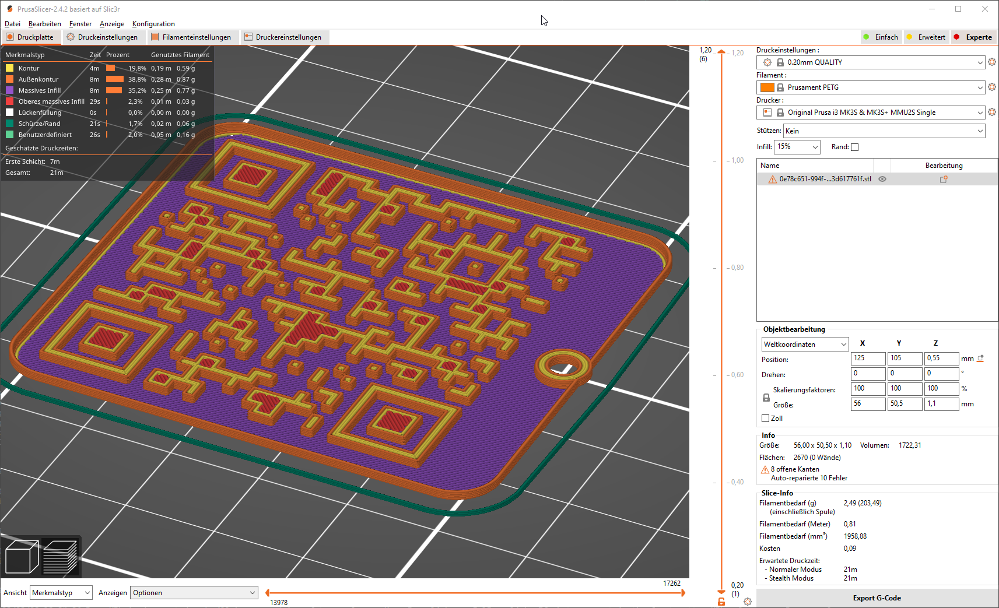

{
    "title": "Getting started"
}

## Find your filament

Goto [Producers](/producers) and select your producer, material and the filament by name. At the moment we don't offer different colors. Maybe we will extend the filament selection sometimes by a color palette.

Each filament can be accesed by a shorter link, this link is used for QR-Code generation.

When you miss one of your producers or materials or filaments, see the [contribute](../contribute.md) page for more information.

## Download .stl

When you have downloaded the .stl file.

## Slice the .stl to .gcode (e.g. with PrusaSlicer)

## Print

> The print will usally take 20 min
> 
> It's total dimensions are 56.0 x 50.5 x 1.1 mm
> 
> Filament used: 2.5 g

## Hold the print against a light source and scan the QR-Code with your smartphone

> You will be redirected to the filament overview on Open-Filament
